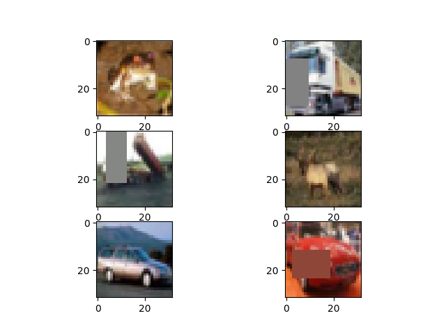
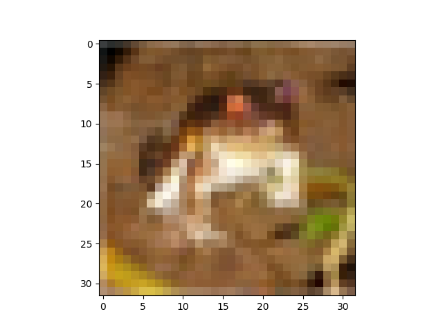
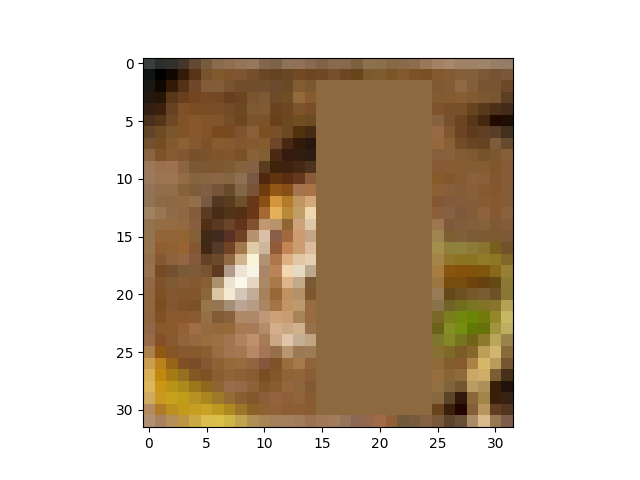

# Random Erasing Data Augmentation
===============================================================

### This code has the source code for the paper "[Random Erasing Data Augmentation](https://arxiv.org/abs/1708.04896)".  

## Imprementation on Python3.7

Thanks for [Zhun Zhong](https://github.com/zhunzhong07),[Liang Zheng](http://liangzheng.com.cn)

| Original image                                                                                             | Random Erasing                                                                                                                        |
|----------------------------------------------------------------------------------------------------------------------------|--------------------------------------------------------------------------------------------------------------------------------------------------------|
|  |  |

### Other re-implementations

[\[Official Torchvision in Transform\]](https://pytorch.org/docs/master/torchvision/transforms.html#torchvision.transforms.RandomErasing)

[\[Pytorch: Random Erasing for ImageNet\]](https://github.com/rwightman/pytorch-image-models)

[\[Python Augmentor\]](http://augmentor.readthedocs.io/en/master/code.html#Augmentor.Pipeline.Pipeline.random_erasing)

[\[Person_reID CamStyle\]](https://github.com/zhunzhong07/CamStyle)

[\[Person_reID_baseline + Random Erasing + Re-ranking\]](https://github.com/layumi/Person_reID_baseline_pytorch)

[\[Keras re-implementation\]](https://github.com/yu4u/cutout-random-erasing)

[YaCpotato](https://github.com/YaCpotato)